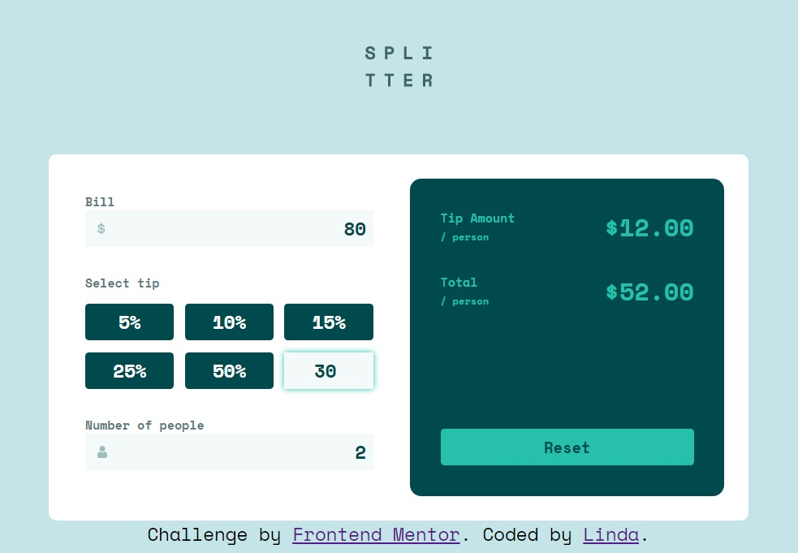

# Frontend Mentor - Tip calculator app solution

This is a solution to the [Tip calculator app challenge on Frontend Mentor](https://www.frontendmentor.io/challenges/tip-calculator-app-ugJNGbJUX). Frontend Mentor challenges help you improve your coding skills by building realistic projects.

### The challenge

Users should be able to:

- View the optimal layout for the app depending on their device's screen size
- See hover states for all interactive elements on the page
- Calculate the correct tip and total cost of the bill per person

### Screenshot

### Links

- Solution URL: [Add solution URL here](https://your-solution-url.com)
- Live Site URL: [Add live site URL here](https://your-live-site-url.com)

## My process

Inspected the figma file, planned the structure of the html, which I will do more thorough next time, bc I had to add several more elements later and that made the naming of classes and IDs difficult, so I ended up with too similar names. 
I created the HTML code and then the javascript, which was very challenging for me. The tricky thing was, that the app is not supposed to simply collect the values and in the end you hit a "calculate button" but instead it had to calculate after every new input. After several evenings working on it, it finally worked and I was so happy.
Then I added the CSS which was also not as easy as I thought it would be bc of the invisible radio buttons in front of the visible labels. But finally I found a solution to change the style of the visible labels based on the state of the invisible radio btns above them. I changed their order in the html, so the radios became previous elements to the labels so they could give style to the labels with the adjacent sibling combinator "+". But to make the radio buttons clickable I gave them a z-index to re-elevate them in front of the labels. 
In the end I added media queries for the desktop version. 
Now there is one CSS issue still left: tabbing through the radio buttons becomes impossible once the focus has been on the costum input. I tried to exclude the costum btn from the radiogroup and removing the checked/focus attribute from the custom btn with js, but no success so far. I would be really thankful if someone could take a little of their time to try and find the issue in my wild code. 

### Built with

- Semantic HTML5 markup
- Flexbox
- Mobile-first workflow
- Javascript

### What I learned

A lot! 
- in js you can't check if(smth == NaN)  but if(isNaN(smth)) 
- smth.toFixed(2) is very useful and easy.
- in CSS "adjacent sibling" means only the one after not the previous one, because CSS only works in one direction. 
- there is "appearance" in CSS but we are not supposed to use it in websites.
- there is aria-live=polite to let screen readers know when smth in the app changes. I hope I used it right. 

### Useful resources

https://developer.mozilla.org/en-US/

## Author

- Frontend Mentor - [@ellienndea](https://www.frontendmentor.io/profile/ellienndea)
- Twitter - [@ellienndea](https://www.twitter.com/ellienndea)
